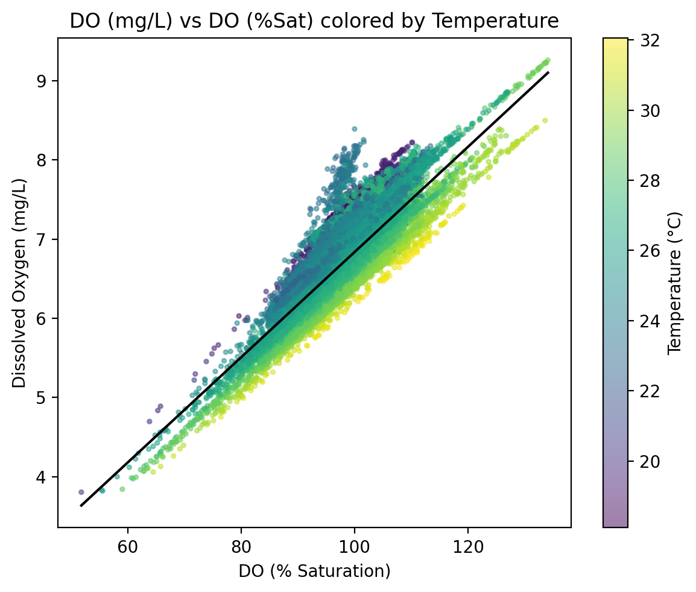

# Brisbane Water Quality Analysis

## 1. Project Overview
This project analyzes water quality data from the Brisbane River to understand how environmental variables affect Dissolved Oxygen (DO) levels over time.  
The goal is to build a clean, time-aligned dataset for time series regression modeling, focusing the prediction of future Dissolved Oxygen (DO) levels.

---

## 2. Data Source
The dataset used in this project comes from Kaggle: 

**Brisbane Water Quality Dataset**  
https://www.kaggle.com/datasets/downshift/water-quality-monitoring-dataset/data

**Collection:** Automated in-situ sensors recording every 10–30 minutes  
**Period:** 2023–2024  
**Variables:** Dissolved Oxygen (mg/L and %Saturation), Temperature, Salinity, pH, Turbidity, Chlorophyll, Conductance, Water Speed, Water Direction, Timestamp

---

## 3. Exploratory Data Analysis (EDA)

### DO vs Temperature
Dissolved Oxygen (mg/L) shows a strong negative correlation with Temperature — higher temperatures correspond to lower oxygen solubility.  

### DO vs DO(%Saturation)
At higher temperatures, the same relative oxygen saturation corresponds to lower absolute DO concentration.  

### Average DO by Hour of Day
Dissolved Oxygen peaks in the afternoon, likely due to increased photosynthetic activity and decreases during the night.  

### Autocorrelation
Explore the autocorrelation of the Dissolved Oxygen 

---

## 4. Dataset Challenges
| Challenge | Description |
|------------|--------------|
| Missing data | Sensor downtime and lag-induced NaNs |
| Non-IID | Time dependence between consecutive measurements |
| Time gaps | Two large discontinuities detected (>80 hrs and >700 hrs) |

---
  
## 5. Data Splitting
To preserve temporal structure, the dataset was divided using `TimeSeriesSplit` from `sklearn.model_selection` instead of random splitting.

| Split | Ratio | Purpose |
|-------|--------|----------|
| Train | 75% | Used for model fitting and scaling |
| Validation | 15% | Used for tuning model parameters |
| Test | 10% | Held out for final evaluation |

---

## 6. Preprocessing
Data preprocessing was implemented through a `ColumnTransformer` pipeline.

| Preprocessor | Applied Features | Purpose |
|---------------|------------------|----------|
| StandardScaler | Numeric continuous variables | Normalize scale and variance |
| MinMaxScaler | pH and %Saturation variables | Preserve bounded natural ranges |
| Drop | Timestamp column | Avoid non-numeric input |

---

## 7. Missing Value Analysis
Before cleaning, approximately 45% of rows contained missing values, mainly caused by lag feature creation and irregular sensor readings.

| Variable | Missing (%) |
|-----------|--------------|
| Dissolved Oxygen (%Saturation) | 23.31 |
| Temperature | 18.14 |
| Dissolved Oxygen | 17.43 |
| Salinity | 16.04 |
| Turbidity | 7.97 |

---

## 8. Future Work
- Interpolate remaining missing values over time  
- Train regression models (Ridge, Random Forest, etc.)  
- Evaluate prediction accuracy on the held-out test set  
- Investigate diurnal and seasonal oxygen trends  

---

## 9. License
This repository is released under the **MIT License**.  

---

## 10. Author
**Xinyi Wu**   
MsDS Brown University
